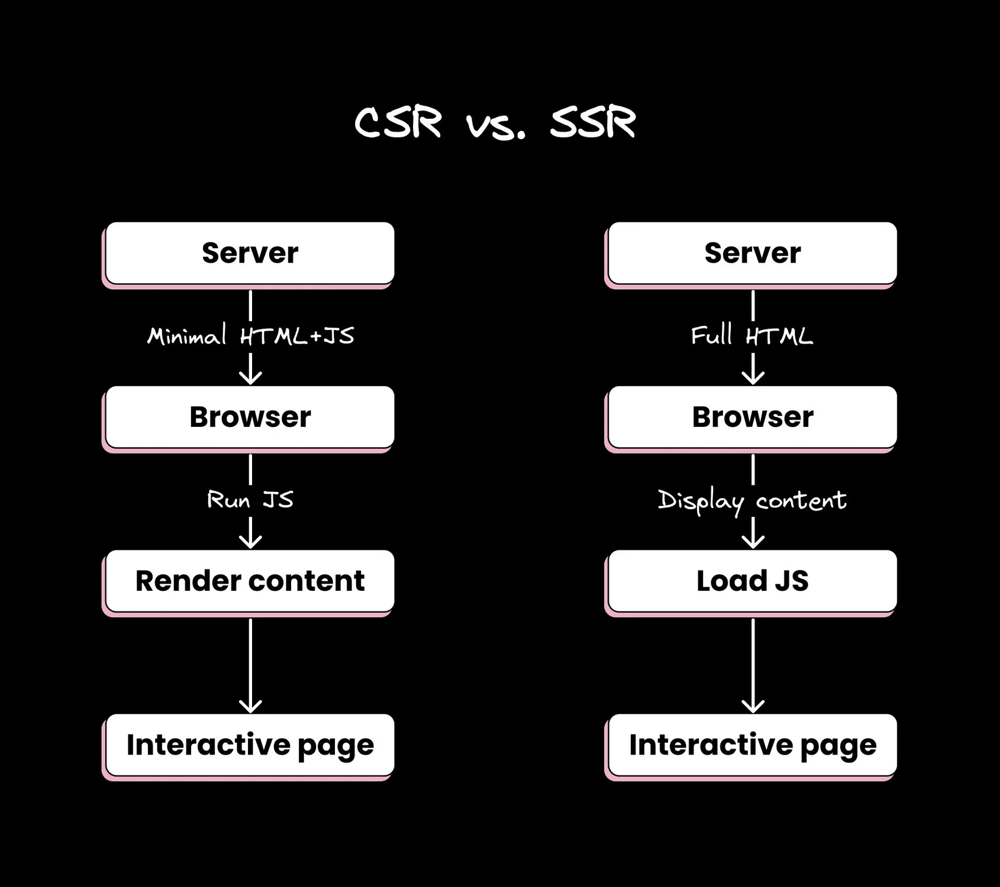
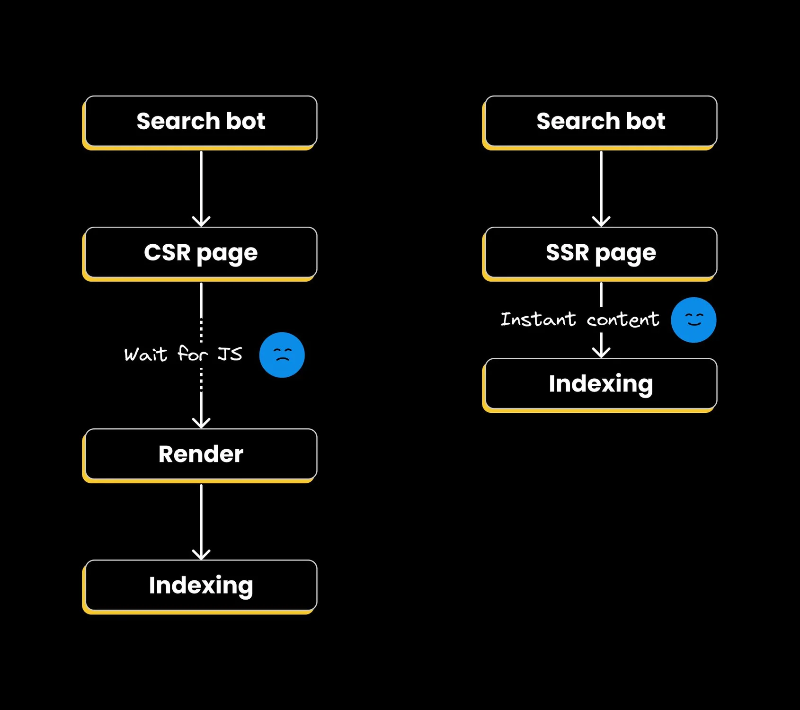
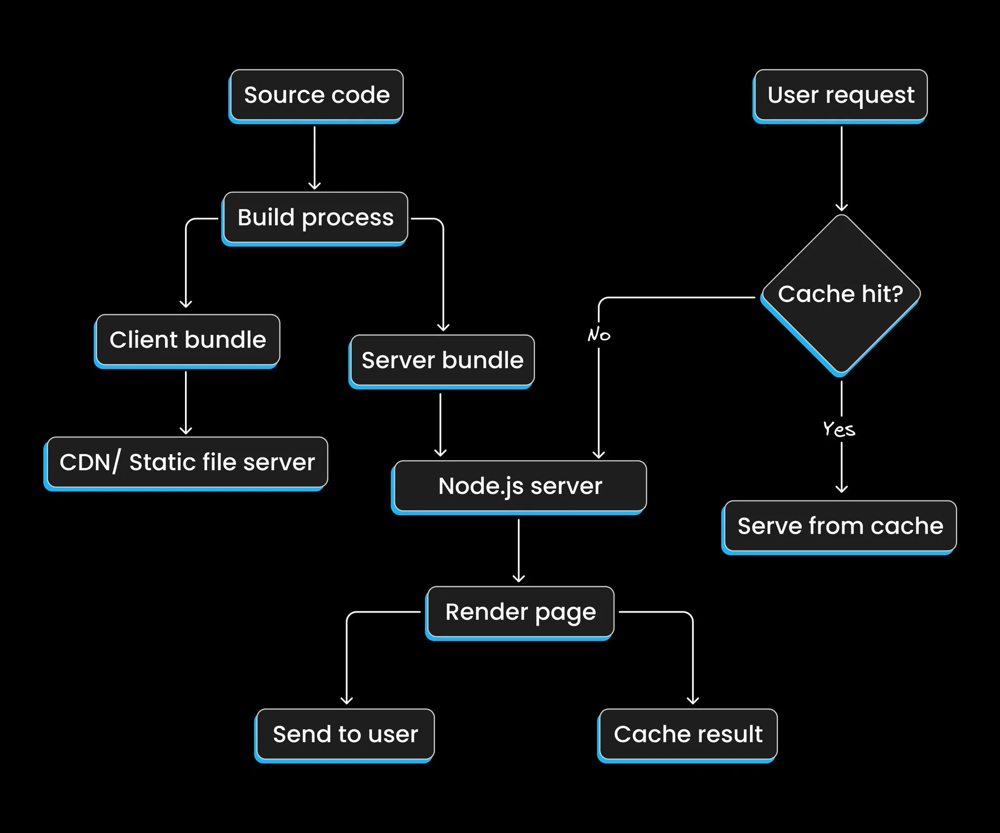
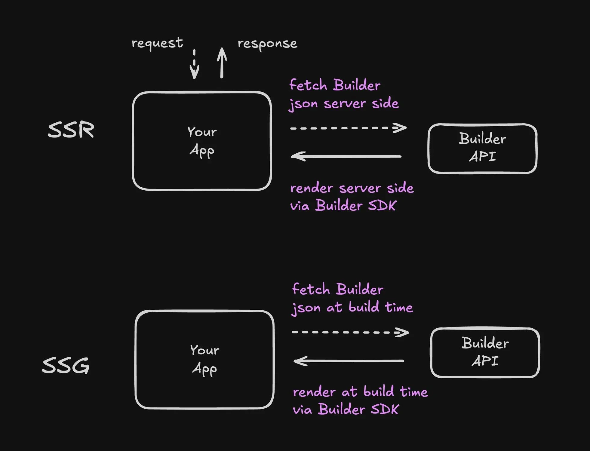

云云众生s关注发布于 2024-11-25 09:14:45发布于 2024-11-25 09:14:459510举报文章被收录于专栏：云云众生s云云众生s服务器端渲染在服务器上生成 HTML。了解 SSR 如何提升 Web 应用的性能和 SEO，以及何时使用它以及何时使用客户端渲染。

 译自 Server-Side Rendering for Better Web Apps - Builder.io，作者 None。

服务器端渲染 (SSR) 已经存在一段时间了，但它值得进一步探索。这项技术可以使您的 Web 应用更快、更利于 SEO。

本指南将解释 SSR，为什么您可能想要使用它，以及如何在不费力的情况下实现它。我们将介绍基础知识，将其与客户端渲染进行比较，并讨论一些实际示例。

### 什么是服务器端渲染？

从根本上说，SSR 是指在服务器上而不是在浏览器上渲染您的网页。当用户请求页面时，服务器会完成所有繁重的工作并将完全渲染的页面发送到客户端。然后，客户端 JavaScript 接管以使其具有交互性。

服务器在厨房里做准备工作，浏览器只需摆盘和上菜。

这是一个最小的 Express.js 示例：

代码语言：javascript复制```
const express = require(&#x27;express&#x27;);
const React = require(&#x27;react&#x27;);
const ReactDOMServer = require(&#x27;react-dom/server&#x27;);
const App = require(&#x27;./App&#x27;);

const app = express();

app.get(&#x27;/&#x27;, (req, res) => {
  const html = ReactDOMServer.renderToString();
  res.send(`
    
    
      
        ${html}
        
      
    
  `);
});

app.listen(3000, () => console.log(&#x27;Server running on port 3000&#x27;));
```
### 从服务器到浏览器，页面完全渲染

当我们谈到 SSR 提供“完全渲染的页面”时，重要的是要理解这实际上意味着什么。让我们分解一下：

什么是完全渲染的页面？完全渲染的页面是一个 HTML 文档，其中包含用户首次加载页面时将获得的所有内容。这包括：

完整的 DOM 结构所有文本内容图片占位符和其他媒体元素初始样式这是一个基本示例：

代码语言：javascript复制```

  
    My SSR Page
    
      /* Initial styles */
    
  
  
    
      Welcome to My Site
      
    
    
      
        Article Title
        This is the full content of the article...
      
    
    
    
  

```
与 CSR 的区别相比之下，客户端渲染 (CSR) 的初始 HTML 可能如下所示：

代码语言：javascript复制```

  
    My CSR Page
  
  
    
    
  

```
CSR 页面完全依赖 JavaScript 来填充内容。

完全渲染HTML的好处 **更快的初始绘制**: 浏览器可以立即开始渲染内容。 **更好的 SEO**: 搜索引擎无需执行 JavaScript 即可读取所有内容。 **改进的辅助功能**: 屏幕阅读器和其他辅助技术可以立即访问内容。 **弹性**: 即使 JavaScript 无法加载，基本内容也可以使用。水合过程发送完全渲染的 HTML 后，SSR 应用程序通常会经历一个称为水合的过程：

服务器发送完全渲染的 HTML。浏览器立即显示此 HTML。JavaScript 加载并水合页面，添加交互性。代码语言：javascript复制```
// Simplified React hydration example
import { hydrateRoot } from &#x27;react-dom/client&#x27;;
import App from &#x27;./App&#x27;;

const domNode = document.getElementById(&#x27;root&#x27;);
hydrateRoot(domNode, );
```
此过程允许快速初始加载，同时仍提供现代 Web 应用的丰富交互性。

请记住，虽然 SSR 提供了这些完全渲染的页面，但它并非没有权衡。服务器的工作量更大，您需要仔细处理服务器和客户端之间的状态。但是，对于许多应用程序而言，完全渲染页面的好处使 SSR 成为一个引人注目的选择。

### CSR 和 SSR 的区别

客户端渲染 (CSR) 和服务器端渲染 (SSR) 是渲染网页的两种不同方法。以下是它们主要区别的细分：

客户端渲染（CSR）服务器发送一个包含JavaScript捆绑包的最小HTML文件。浏览器下载并运行JavaScript。JavaScript创建页面内容并使其具有交互性。优点：

初始加载后交互流畅所需服务器资源更少缺点：

初始页面加载速度较慢可能面临搜索引擎优化挑战服务器端渲染（SSR）服务器创建完整的HTML内容。浏览器接收并快速显示预渲染的HTML。然后JavaScript加载以使页面完全交互。优点：

页面初始加载更快对搜索引擎优化（SEO）更有利适合在较慢的设备上工作缺点：

设置可能更复杂可能会使用更多的服务器资源这是一个简单的视觉比较：


本质上，CSR 在浏览器中运行更多，而 SSR 在服务器上运行更多。它们之间的选择取决于项目的特定需求，平衡初始加载时间、SEO 要求和服务器资源等因素。

### SSR和搜索引擎：HTTP中的完美搭配

服务器端渲染会对搜索引擎查看您网站的方式产生重大影响。让我们分解一下：

更快的索引搜索引擎机器人没有耐心。它们想立刻看到内容。有了服务器端渲染（SSR），当机器人来抓取时，页面已经准备好了——不需要等待JavaScript加载和渲染。


内容一致性SSR确保搜索引擎看到的内容与用户看到的相同。使用客户端渲染，总是存在机器人可能错过一些动态加载内容的风险。

提升加载时间搜索引擎喜欢快速的网站。服务器端渲染（SSR）可以显著减少初始加载时间，这可能会让你在排名上获得轻微的优势。

代码语言：javascript复制```
// Pseudo-code for search engine ranking
function calculateRanking(site) {
  let score = site.relevance;
  if (site.loadTime 
```
移动优先的索引谷歌的移动优先索引使得服务器端渲染在较慢的移动连接上的性能优势变得更加重要。

社交媒体预览虽然不是严格的搜索引擎功能，SSR使得在内容被分享到社交平台时生成准确的预览变得更加容易。这可以通过增加参与度和反向链接间接提升你的SEO。

代码语言：javascript复制```

```
SSR是SEO的强大工具，但并非唯一因素。内容质量、相关性和整体用户体验在搜索引擎排名中至关重要。SSR只是确保搜索引擎能够高效地爬取和索引你的内容，可能会让你在可见性和性能指标上获得优势。

### 如何实际进行SSR

实现SSR并不复杂。让我们来探讨如何使用Next.js，一个流行的React框架，使得SSR变得简单直接：

设置一个Next.js项目。创建服务器端渲染页面。让Next.js处理完全渲染的HTML和客户端水合。这里有一个使用App Router的简单Next.js示例：

代码语言：javascript复制```
// app/page.js
async function getData() {
  const res = await fetch(&#x27;&#x27;)
  if (!res.ok) {
    throw new Error(&#x27;Failed to fetch data&#x27;)
  }
  return res.json()
}

export default async function Home() {
  const data = await getData()

  return Hello {data.name}
}
```
在这个例子中：

Home组件是一个异步函数，允许进行服务器端数据获取。getData()获取我们所需的数据。组件直接渲染数据。Next.js自动处理SSR过程：

当请求进来时，Next.js在服务器上运行这个组件。它等待数据被获取。它用获取到的数据渲染组件。完全渲染的HTML被发送到客户端。一旦浏览器中的JavaScript加载完成，页面就变得可交互。这种方法让你享受到SSR的好处，而无需手动设置服务器或自己管理渲染过程。

### 更高级的 SSR 解决方案

如果你不想重新发明轮子，有几个框架可以为你处理服务器端渲染（SSR）的复杂性。以下是不同生态系统中流行的选项：


React

Next.js：内置SSR支持的最流行的React框架。Remix：利用React Router的全栈Web框架。Gatsby：主要是静态站点生成器，但也支持SSR。Vue

Nuxt.js：Vue应用的首选框架，具备SSR能力。Angular

Angular Universal：Angular应用的官方SSR解决方案。Svelte

SvelteKit：Svelte的官方应用框架，支持SSR。JavaScript（框架无关）

Astro：允许你使用多个框架，并支持SSR。Qwik：一个为最佳性能设计的新型框架，内置SSR支持。PHP

Laravel：通过Inertia.js或其自己的Livewire组件提供SSR能力。Ruby

Ruby on Rails：通过Stimulus Reflex或Hotwire等工具支持SSR。Python

Django：可以使用Django-Unicorn或HTMX等库实现SSR。Flask：可以配置为SSR，通常与Flask-SSE等扩展一起使用。这些框架各自提供了对SSR的不同方法，通常还包含静态站点生成、API路由等附加功能。选择取决于你偏好的语言、生态系统和特定项目需求。

### 部署和缓存

在部署SSR应用时：

构建客户端和服务器端的捆绑包。将SSR服务器作为后台进程运行。使用像PM2或Supervisor这样的进程监控器来保持服务器运行。这是一个基本的部署流程：


不要忘记缓存！缓存服务器渲染的页面可以显著降低服务器负载。

### Builder.io 中的 SSR

Builder.io 提供了对所有组件和框架的服务器端渲染（SSR）和静态站点生成（SSG）的支持。这种即开即用的功能允许你在无需额外设置的情况下利用 SSR 和 SSG 的优势。


关键特性 **框架无关性**: Builder.io 支持各种支持 SSR 和 SSG 的框架。 **自动优化**: Builder 会优化您的内容性能，包括代码分割和屏幕外组件的延迟加载。 **动态渲染**: 您可以根据用户属性或A/B 测试渲染不同的内容，同时保持SEO 优势。 **轻松集成**: Builder 提供SDK 和文档，以便无缝集成您的现有项目。实施示例以下是如何使用Builder 和 Next.js在服务器端获取和渲染内容的基本示例：

代码语言：javascript复制```
import { builder, BuilderComponent } from &#x27;@builder.io/react&#x27;

builder.init(&#x27;YOUR_API_KEY&#x27;)

export async function getStaticProps({ params }) {
  const page = await builder
    .get(&#x27;page&#x27;, {
      userAttributes: {
        urlPath: &#x27;/&#x27; + (params?.page?.join(&#x27;/&#x27;) || &#x27;&#x27;)
      }
    })
    .toPromise()

  return {
    props: {
      page: page || null,
    },
    revalidate: 5
  }
}

export default function Page({ page }) {
  return (
    
  )
}
```
最佳实践确保您正在使用支持 SSR 或 SSG 的框架。集成 Builder 页面或区块时，请遵循框架的服务器端数据获取指南。有关处理服务器端数据的更多信息，请参阅`getAsyncProps`自述文件。通过利用 Builder 进行 SSR，您可以将无头 CMS 的灵活性和服务器端渲染的性能优势相结合，同时保持易于使用的可视化编辑体验。

### 收尾

服务器端渲染 (SSR) 是一种强大的 Web 开发方法，可以显著提高应用程序的性能、SEO 和用户体验。在本文中，我们探讨了 SSR 的含义、它与客户端渲染的不同之处、它对搜索引擎的影响以及使用Next.js 等流行框架的实际实施策略。

我们还讨论了完全渲染页面的概念，并检查了不同生态系统中的各种 SSR 解决方案。虽然 SSR 提供了许多好处，但在决定是否实施它时，务必考虑项目的具体需求。

**问：SSR 如何影响我的开发工作流程？** 答：SSR 可能会使开发变得更加复杂，因为您需要同时考虑服务器和客户端环境。您可能需要调整构建过程并注意特定于浏览器的 API。

**问：SSR 如何影响我网站的交互时间 (TTI)？** 答：虽然 SSR 可以提高初始内容可见性，但它可能会稍微延迟 TTI，因为浏览器需要在收到初始 HTML 后加载和水化 JavaScript。

**问：SSR 有哪些特定的安全注意事项？** 答：是的，使用 SSR 时，您需要更加小心地保护服务器端敏感数据或 API。始终清理用户输入，并注意在初始渲染中包含哪些数据。

**问：SSR 如何与身份验证和个性化内容一起使用？** 答：SSR 可以与身份验证一起使用，但这需要仔细处理。您可能需要实现 JWT 令牌或服务器端会话等技术来管理经过身份验证的 SSR 请求。

本文参与 腾讯云自媒体同步曝光计划，分享自作者个人站点/博客。 原始发表：2024-11-242，如有侵权请联系 cloudcommunity@tencent.com 删除前往查看web服务端渲染服务器框架渲染本文分享自 作者个人站点/博客 前往查看

如有侵权，请联系 cloudcommunity@tencent.com 删除。

本文参与 腾讯云自媒体同步曝光计划  ，欢迎热爱写作的你一起参与！

web服务端渲染服务器框架渲染评论登录后参与评论0 条评论热度最新登录 后参与评论推荐阅读目录什么是服务器端渲染？从服务器到浏览器，页面完全渲染什么是完全渲染的页面？与 CSR 的区别完全渲染HTML的好处水合过程CSR 和 SSR 的区别客户端渲染（CSR）服务器端渲染（SSR）SSR和搜索引擎：HTTP中的完美搭配如何实际进行SSR更高级的 SSR 解决方案部署和缓存Builder.io 中的 SSR关键特性实施示例最佳实践收尾领券### 社区

技术文章技术问答技术沙龙技术视频学习中心技术百科技术专区### 活动

自媒体同步曝光计划邀请作者入驻自荐上首页技术竞赛### 圈层

腾讯云最具价值专家腾讯云架构师技术同盟腾讯云创作之星腾讯云TDP### 关于

社区规范免责声明联系我们友情链接MCP广场开源版权声明### 腾讯云开发者


扫码关注腾讯云开发者

领取腾讯云代金券

### 热门产品

域名注册云服务器区块链服务消息队列网络加速云数据库域名解析云存储视频直播### 热门推荐

人脸识别腾讯会议企业云CDN加速视频通话图像分析MySQL 数据库SSL 证书语音识别### 更多推荐

数据安全负载均衡短信文字识别云点播大数据小程序开发网站监控数据迁移Copyright © 2013 - 2026 Tencent Cloud. All Rights Reserved. 腾讯云 版权所有 

深圳市腾讯计算机系统有限公司 ICP备案/许可证号：粤B2-20090059 

粤公网安备44030502008569号

腾讯云计算（北京）有限责任公司 京ICP证150476号 |  京ICP备11018762号

问题归档专栏文章快讯文章归档关键词归档开发者手册归档开发者手册 Section 归档Copyright © 2013 - 2026 Tencent Cloud.

All Rights Reserved. 腾讯云 版权所有

登录 后参与评论000推荐
          if (!String.prototype.replaceAll) {
            String.prototype.replaceAll = function (str, newStr) {
              // If a regex pattern
              if (Object.prototype.toString.call(str).toLowerCase() === '[object regexp]') {
                return this.replace(str, newStr);
              }
        
              // If a string
              return this.replace(new RegExp(str, 'g'), newStr);
            };
          }
          {"props":{"isMobile":false,"isSupportWebp":false,"currentDomain":"cloud.tencent.com","baseUrl":"https://cloud.tencent.com","reqId":"-ad20oz6WEVe1FtX6DZQU","query":{"articleId":"2470433"},"platform":"other","env":"production","__N_SSP":true,"pageProps":{"fallback":{"#url:\"/api/article/detail\",params:#articleId:2470433,,":{"articleData":{"articleId":2470433,"codeLineNum":114,"readingTime":876,"wordsNum":4013},"articleInfo":{"articleId":2470433,"channel":2,"commentNum":0,"content":{"blocks":[{"key":"77ocg","text":"服务器端渲染在服务器上生成 HTML。了解 SSR 如何提升 Web 应用的性能和 SEO，以及何时使用它以及何时使用客户端渲染。","type":"unstyled","depth":0,"inlineStyleRanges":[],"entityRanges":[],"data":{}},{"key":"9u1n5","text":" 译自 Server-Side Rendering for Better Web Apps - Builder.io，作者 None。","type":"blockquote","depth":0,"inlineStyleRanges":[],"entityRanges":[{"offset":4,"length":54,"key":0}],"data":{}},{"key":"50s8t","text":"服务器端渲染 (SSR) 已经存在一段时间了，但它值得进一步探索。这项技术可以使您的 Web 应用更快、更利于 SEO。","type":"unstyled","depth":0,"inlineStyleRanges":[],"entityRanges":[],"data":{}},{"key":"en2ul","text":"本指南将解释 SSR，为什么您可能想要使用它，以及如何在不费力的情况下实现它。我们将介绍基础知识，将其与客户端渲染进行比较，并讨论一些实际示例。","type":"unstyled","depth":0,"inlineStyleRanges":[],"entityRanges":[],"data":{}},{"key":"2ocr7","text":"什么是服务器端渲染？","type":"header-two","depth":0,"inlineStyleRanges":[],"entityRanges":[],"data":{"text":"%E4%BB%80%E4%B9%88%E6%98%AF%E6%9C%8D%E5%8A%A1%E5%99%A8%E7%AB%AF%E6%B8%B2%E6%9F%93%EF%BC%9F"}},{"key":"emq66","text":"从根本上说，SSR 是指在服务器上而不是在浏览器上渲染您的网页。当用户请求页面时，服务器会完成所有繁重的工作并将完全渲染的页面发送到客户端。然后，客户端 JavaScript 接管以使其具有交互性。","type":"unstyled","depth":0,"inlineStyleRanges":[],"entityRanges":[],"data":{}},{"key":"bna2o","text":"服务器在厨房里做准备工作，浏览器只需摆盘和上菜。","type":"unstyled","depth":0,"inlineStyleRanges":[],"entityRanges":[],"data":{}},{"key":"458lk","text":"这是一个最小的 Express.js 示例：","type":"unstyled","depth":0,"inlineStyleRanges":[],"entityRanges":[],"data":{}},{"key":"elndu","text":"const express = require('express');\nconst React = require('react');\nconst ReactDOMServer = require('react-dom/server');\nconst App = require('./App');\n\nconst app = express();\n\napp.get('/', (req, res) =\u003e {\n  const html = ReactDOMServer.renderToString(\u003cApp /\u003e);\n  res.send(`\n    \u003c!DOCTYPE html\u003e\n    \u003chtml\u003e\n      \u003cbody\u003e\n        \u003cdiv id=\"root\"\u003e${html}\u003c/div\u003e\n        \u003cscript src=\"client.js\"\u003e\u003c/script\u003e\n      \u003c/body\u003e\n    \u003c/html\u003e\n  `);\n});\n\napp.listen(3000, () =\u003e console.log('Server running on port 3000'));","type":"code-block","depth":0,"inlineStyleRanges":[],"entityRanges":[],"data":{"syntax":"javascript"}},{"key":"2rp6v","text":"从服务器到浏览器，页面完全渲染","type":"header-two","depth":0,"inlineStyleRanges":[],"entityRanges":[],"data":{"text":"%E4%BB%8E%E6%9C%8D%E5%8A%A1%E5%99%A8%E5%88%B0%E6%B5%8F%E8%A7%88%E5%99%A8%EF%BC%8C%E9%A1%B5%E9%9D%A2%E5%AE%8C%E5%85%A8%E6%B8%B2%E6%9F%93"}},{"key":"f2n33","text":"当我们谈到 SSR 提供“完全渲染的页面”时，重要的是要理解这实际上意味着什么。让我们分解一下：","type":"unstyled","depth":0,"inlineStyleRanges":[],"entityRanges":[],"data":{}},{"key":"f4rfn","text":"什么是完全渲染的页面？","type":"header-three","depth":0,"inlineStyleRanges":[],"entityRanges":[],"data":{"text":"%E4%BB%80%E4%B9%88%E6%98%AF%E5%AE%8C%E5%85%A8%E6%B8%B2%E6%9F%93%E7%9A%84%E9%A1%B5%E9%9D%A2%EF%BC%9F"}},{"key":"42d08","text":"完全渲染的页面是一个 HTML 文档，其中包含用户首次加载页面时将获得的所有内容。这包括：","type":"unstyled","depth":0,"inlineStyleRanges":[],"entityRanges":[],"data":{}},{"key":"de8gf","text":"完整的 DOM 结构","type":"ordered-list-item","depth":0,"inlineStyleRanges":[],"entityRanges":[],"data":{}},{"key":"9h40u","text":"所有文本内容","type":"ordered-list-item","depth":0,"inlineStyleRanges":[],"entityRanges":[],"data":{}},{"key":"8be1r","text":"图片占位符和其他媒体元素","type":"ordered-list-item","depth":0,"inlineStyleRanges":[],"entityRanges":[],"data":{}},{"key":"d84lf","text":"初始样式","type":"ordered-list-item","depth":0,"inlineStyleRanges":[],"entityRanges":[],"data":{}},{"key":"fdhnr","text":"这是一个基本示例：","type":"unstyled","depth":0,"inlineStyleRanges":[],"entityRanges":[],"data":{}},{"key":"fe9vn","text":"\u003c!DOCTYPE html\u003e\n\u003chtml\u003e\n  \u003chead\u003e\n    \u003ctitle\u003eMy SSR Page\u003c/title\u003e\n    \u003cstyle\u003e\n      /* Initial styles */\n    \u003c/style\u003e\n  \u003c/head\u003e\n  \u003cbody\u003e\n    \u003cheader\u003e\n      \u003ch1\u003eWelcome to My Site\u003c/h1\u003e\n      \u003cnav\u003e\u003c!-- Fully populated navigation --\u003e\u003c/nav\u003e\n    \u003c/header\u003e\n    \u003cmain\u003e\n      \u003carticle\u003e\n        \u003ch2\u003eArticle Title\u003c/h2\u003e\n        \u003cp\u003eThis is the full content of the article...\u003c/p\u003e\n      \u003c/article\u003e\n    \u003c/main\u003e\n    \u003cfooter\u003e\u003c!-- Fully populated footer --\u003e\u003c/footer\u003e\n    \u003cscript src=\"hydration.js\"\u003e\u003c/script\u003e\n  \u003c/body\u003e\n\u003c/html\u003e","type":"code-block","depth":0,"inlineStyleRanges":[],"entityRanges":[],"data":{"syntax":"javascript"}},{"key":"40pru","text":"与 CSR 的区别","type":"header-three","depth":0,"inlineStyleRanges":[],"entityRanges":[],"data":{"text":"%E4%B8%8E-CSR-%E7%9A%84%E5%8C%BA%E5%88%AB"}},{"key":"6714l","text":"相比之下，客户端渲染 (CSR) 的初始 HTML 可能如下所示：","type":"unstyled","depth":0,"inlineStyleRanges":[],"entityRanges":[],"data":{}},{"key":"bhdid","text":"\u003c!DOCTYPE html\u003e\n\u003chtml\u003e\n  \u003chead\u003e\n    \u003ctitle\u003eMy CSR Page\u003c/title\u003e\n  \u003c/head\u003e\n  \u003cbody\u003e\n    \u003cdiv id=\"root\"\u003e\u003c/div\u003e\n    \u003cscript src=\"bundle.js\"\u003e\u003c/script\u003e\n  \u003c/body\u003e\n\u003c/html\u003e","type":"code-block","depth":0,"inlineStyleRanges":[],"entityRanges":[],"data":{"syntax":"javascript"}},{"key":"8t31o","text":"CSR 页面完全依赖 JavaScript 来填充内容。","type":"unstyled","depth":0,"inlineStyleRanges":[],"entityRanges":[],"data":{}},{"key":"epmc3","text":"完全渲染HTML的好处","type":"header-three","depth":0,"inlineStyleRanges":[],"entityRanges":[],"data":{"text":"%E5%AE%8C%E5%85%A8%E6%B8%B2%E6%9F%93HTML%E7%9A%84%E5%A5%BD%E5%A4%84"}},{"key":"1bjc9","text":" 更快的初始绘制: 浏览器可以立即开始渲染内容。","type":"ordered-list-item","depth":0,"inlineStyleRanges":[{"offset":1,"length":7,"style":"BOLD"}],"entityRanges":[],"data":{}},{"key":"e5qjr","text":" 更好的 SEO: 搜索引擎无需执行 JavaScript 即可读取所有内容。","type":"ordered-list-item","depth":0,"inlineStyleRanges":[{"offset":1,"length":7,"style":"BOLD"}],"entityRanges":[],"data":{}},{"key":"13p4f","text":" 改进的辅助功能: 屏幕阅读器和其他辅助技术可以立即访问内容。","type":"ordered-list-item","depth":0,"inlineStyleRanges":[{"offset":1,"length":7,"style":"BOLD"}],"entityRanges":[],"data":{}},{"key":"9vc84","text":" 弹性: 即使 JavaScript 无法加载，基本内容也可以使用。","type":"ordered-list-item","depth":0,"inlineStyleRanges":[{"offset":1,"length":2,"style":"BOLD"}],"entityRanges":[],"data":{}},{"key":"1s4io","text":"水合过程","type":"header-three","depth":0,"inlineStyleRanges":[],"entityRanges":[],"data":{"text":"%E6%B0%B4%E5%90%88%E8%BF%87%E7%A8%8B"}},{"key":"7e5v5","text":"发送完全渲染的 HTML 后，SSR 应用程序通常会经历一个称为水合的过程：","type":"unstyled","depth":0,"inlineStyleRanges":[],"entityRanges":[{"offset":32,"length":2,"key":1}],"data":{}},{"key":"ea1n8","text":"服务器发送完全渲染的 HTML。","type":"ordered-list-item","depth":0,"inlineStyleRanges":[],"entityRanges":[],"data":{}},{"key":"f11jp","text":"浏览器立即显示此 HTML。","type":"ordered-list-item","depth":0,"inlineStyleRanges":[],"entityRanges":[],"data":{}},{"key":"9e6ht","text":"JavaScript 加载并水合页面，添加交互性。","type":"ordered-list-item","depth":0,"inlineStyleRanges":[{"offset":14,"length":2,"style":"ITALIC"}],"entityRanges":[],"data":{}},{"key":"1a6qd","text":"// Simplified React hydration example\nimport { hydrateRoot } from 'react-dom/client';\nimport App from './App';\n\nconst domNode = document.getElementById('root');\nhydrateRoot(domNode, \u003cApp /\u003e);","type":"code-block","depth":0,"inlineStyleRanges":[],"entityRanges":[],"data":{"syntax":"javascript"}},{"key":"45cgf","text":"此过程允许快速初始加载，同时仍提供现代 Web 应用的丰富交互性。","type":"unstyled","depth":0,"inlineStyleRanges":[],"entityRanges":[],"data":{}},{"key":"9n30q","text":"请记住，虽然 SSR 提供了这些完全渲染的页面，但它并非没有权衡。服务器的工作量更大，您需要仔细处理服务器和客户端之间的状态。但是，对于许多应用程序而言，完全渲染页面的好处使 SSR 成为一个引人注目的选择。","type":"unstyled","depth":0,"inlineStyleRanges":[],"entityRanges":[],"data":{}},{"key":"4lagf","text":"CSR 和 SSR 的区别","type":"header-two","depth":0,"inlineStyleRanges":[],"entityRanges":[],"data":{"text":"CSR-%E5%92%8C-SSR-%E7%9A%84%E5%8C%BA%E5%88%AB"}},{"key":"3i66j","text":"客户端渲染 (CSR) 和服务器端渲染 (SSR) 是渲染网页的两种不同方法。以下是它们主要区别的细分：","type":"unstyled","depth":0,"inlineStyleRanges":[],"entityRanges":[],"data":{}},{"key":"65n6","text":"客户端渲染（CSR）","type":"header-three","depth":0,"inlineStyleRanges":[],"entityRanges":[],"data":{"text":"%E5%AE%A2%E6%88%B7%E7%AB%AF%E6%B8%B2%E6%9F%93%EF%BC%88CSR%EF%BC%89"}},{"key":"862kg","text":"服务器发送一个包含JavaScript捆绑包的最小HTML文件。","type":"ordered-list-item","depth":0,"inlineStyleRanges":[],"entityRanges":[],"data":{}},{"key":"etb75","text":"浏览器下载并运行JavaScript。","type":"ordered-list-item","depth":0,"inlineStyleRanges":[],"entityRanges":[],"data":{}},{"key":"4ovhq","text":"JavaScript创建页面内容并使其具有交互性。","type":"ordered-list-item","depth":0,"inlineStyleRanges":[],"entityRanges":[],"data":{}},{"key":"d72ln","text":"优点：","type":"unstyled","depth":0,"inlineStyleRanges":[],"entityRanges":[],"data":{}},{"key":"58hc4","text":"初始加载后交互流畅","type":"unordered-list-item","depth":0,"inlineStyleRanges":[],"entityRanges":[],"data":{}},{"key":"cf4is","text":"所需服务器资源更少","type":"unordered-list-item","depth":0,"inlineStyleRanges":[],"entityRanges":[],"data":{}},{"key":"8k7s","text":"缺点：","type":"unstyled","depth":0,"inlineStyleRanges":[],"entityRanges":[],"data":{}},{"key":"142a2","text":"初始页面加载速度较慢","type":"unordered-list-item","depth":0,"inlineStyleRanges":[],"entityRanges":[],"data":{}},{"key":"2fmhs","text":"可能面临搜索引擎优化挑战","type":"unordered-list-item","depth":0,"inlineStyleRanges":[],"entityRanges":[],"data":{}},{"key":"1ir6q","text":"服务器端渲染（SSR）","type":"header-three","depth":0,"inlineStyleRanges":[],"entityRanges":[],"data":{"text":"%E6%9C%8D%E5%8A%A1%E5%99%A8%E7%AB%AF%E6%B8%B2%E6%9F%93%EF%BC%88SSR%EF%BC%89"}},{"key":"6865o","text":"服务器创建完整的HTML内容。","type":"ordered-list-item","depth":0,"inlineStyleRanges":[],"entityRanges":[],"data":{}},{"key":"97jau","text":"浏览器接收并快速显示预渲染的HTML。","type":"ordered-list-item","depth":0,"inlineStyleRanges":[],"entityRanges":[],"data":{}},{"key":"bh0uq","text":"然后JavaScript加载以使页面完全交互。","type":"ordered-list-item","depth":0,"inlineStyleRanges":[],"entityRanges":[],"data":{}},{"key":"13bbs","text":"优点：","type":"unstyled","depth":0,"inlineStyleRanges":[],"entityRanges":[],"data":{}},{"key":"57vo8","text":"页面初始加载更快","type":"unordered-list-item","depth":0,"inlineStyleRanges":[],"entityRanges":[],"data":{}},{"key":"4ldg6","text":"对搜索引擎优化（SEO）更有利","type":"unordered-list-item","depth":0,"inlineStyleRanges":[],"entityRanges":[],"data":{}},{"key":"bmomp","text":"适合在较慢的设备上工作","type":"unordered-list-item","depth":0,"inlineStyleRanges":[],"entityRanges":[],"data":{}},{"key":"1t1sj","text":"缺点：","type":"unstyled","depth":0,"inlineStyleRanges":[],"entityRanges":[],"data":{}},{"key":"2mqjj","text":"设置可能更复杂","type":"unordered-list-item","depth":0,"inlineStyleRanges":[],"entityRanges":[],"data":{}},{"key":"5l2lt","text":"可能会使用更多的服务器资源","type":"unordered-list-item","depth":0,"inlineStyleRanges":[],"entityRanges":[],"data":{}},{"key":"392ji","text":"这是一个简单的视觉比较：","type":"unstyled","depth":0,"inlineStyleRanges":[],"entityRanges":[],"data":{}},{"key":"9qplp","text":"\ud83d","type":"atomic","depth":0,"inlineStyleRanges":[],"entityRanges":[{"offset":0,"length":1,"key":2}],"data":{}},{"key":"29r23","text":"本质上，CSR 在浏览器中运行更多，而 SSR 在服务器上运行更多。它们之间的选择取决于项目的特定需求，平衡初始加载时间、SEO 要求和服务器资源等因素。","type":"unstyled","depth":0,"inlineStyleRanges":[],"entityRanges":[],"data":{}},{"key":"6sn6b","text":"SSR和搜索引擎：HTTP中的完美搭配","type":"header-two","depth":0,"inlineStyleRanges":[],"entityRanges":[],"data":{"text":"SSR%E5%92%8C%E6%90%9C%E7%B4%A2%E5%BC%95%E6%93%8E%EF%BC%9AHTTP%E4%B8%AD%E7%9A%84%E5%AE%8C%E7%BE%8E%E6%90%AD%E9%85%8D"}},{"key":"85uq4","text":"服务器端渲染会对搜索引擎查看您网站的方式产生重大影响。让我们分解一下：","type":"unstyled","depth":0,"inlineStyleRanges":[],"entityRanges":[],"data":{}},{"key":"69v67","text":"更快的索引","type":"ordered-list-item","depth":0,"inlineStyleRanges":[],"entityRanges":[],"data":{}},{"key":"2b8dd","text":"搜索引擎机器人没有耐心。它们想立刻看到内容。有了服务器端渲染（SSR），当机器人来抓取时，页面已经准备好了——不需要等待JavaScript加载和渲染。","type":"unstyled","depth":0,"inlineStyleRanges":[],"entityRanges":[],"data":{}},{"key":"1hom1","text":"\ud83d","type":"atomic","depth":0,"inlineStyleRanges":[],"entityRanges":[{"offset":0,"length":1,"key":3}],"data":{}},{"key":"bs9eg","text":"内容一致性","type":"ordered-list-item","depth":0,"inlineStyleRanges":[],"entityRanges":[],"data":{}},{"key":"2qs5m","text":"SSR确保搜索引擎看到的内容与用户看到的相同。使用客户端渲染，总是存在机器人可能错过一些动态加载内容的风险。","type":"unstyled","depth":0,"inlineStyleRanges":[],"entityRanges":[],"data":{}},{"key":"1s8c","text":"提升加载时间","type":"ordered-list-item","depth":0,"inlineStyleRanges":[],"entityRanges":[],"data":{}},{"key":"3e3vs","text":"搜索引擎喜欢快速的网站。服务器端渲染（SSR）可以显著减少初始加载时间，这可能会让你在排名上获得轻微的优势。","type":"unstyled","depth":0,"inlineStyleRanges":[],"entityRanges":[],"data":{}},{"key":"dct2h","text":"// Pseudo-code for search engine ranking\nfunction calculateRanking(site) {\n  let score = site.relevance;\n  if (site.loadTime \u003c FAST_THRESHOLD) {\n    score += SPEED_BONUS;\n  }\n  return score;\n}","type":"code-block","depth":0,"inlineStyleRanges":[],"entityRanges":[],"data":{"syntax":"javascript"}},{"key":"fpsel","text":"移动优先的索引","type":"ordered-list-item","depth":0,"inlineStyleRanges":[],"entityRanges":[],"data":{}},{"key":"c69em","text":"谷歌的移动优先索引使得服务器端渲染在较慢的移动连接上的性能优势变得更加重要。","type":"unstyled","depth":0,"inlineStyleRanges":[],"entityRanges":[],"data":{}},{"key":"fkg3e","text":"社交媒体预览","type":"ordered-list-item","depth":0,"inlineStyleRanges":[],"entityRanges":[],"data":{}},{"key":"ecrmc","text":"虽然不是严格的搜索引擎功能，SSR使得在内容被分享到社交平台时生成准确的预览变得更加容易。这可以通过增加参与度和反向链接间接提升你的SEO。","type":"unstyled","depth":0,"inlineStyleRanges":[],"entityRanges":[],"data":{}},{"key":"5l14f","text":"\u003c!-- SSR makes it easier to include accurate meta tags --\u003e\n\u003cmeta property=\"og:title\" content=\"Your Dynamic Title Here\"\u003e\n\u003cmeta property=\"og:description\" content=\"Your Dynamic Description Here\"\u003e","type":"code-block","depth":0,"inlineStyleRanges":[],"entityRanges":[],"data":{"syntax":"javascript"}},{"key":"c4m9i","text":"SSR是SEO的强大工具，但并非唯一因素。内容质量、相关性和整体用户体验在搜索引擎排名中至关重要。SSR只是确保搜索引擎能够高效地爬取和索引你的内容，可能会让你在可见性和性能指标上获得优势。","type":"unstyled","depth":0,"inlineStyleRanges":[],"entityRanges":[],"data":{}},{"key":"e8d12","text":"如何实际进行SSR","type":"header-two","depth":0,"inlineStyleRanges":[],"entityRanges":[],"data":{"text":"%E5%A6%82%E4%BD%95%E5%AE%9E%E9%99%85%E8%BF%9B%E8%A1%8CSSR"}},{"key":"c4v6u","text":"实现SSR并不复杂。让我们来探讨如何使用Next.js，一个流行的React框架，使得SSR变得简单直接：","type":"unstyled","depth":0,"inlineStyleRanges":[],"entityRanges":[],"data":{}},{"key":"bgp8a","text":"设置一个Next.js项目。","type":"ordered-list-item","depth":0,"inlineStyleRanges":[],"entityRanges":[],"data":{}},{"key":"e516u","text":"创建服务器端渲染页面。","type":"ordered-list-item","depth":0,"inlineStyleRanges":[],"entityRanges":[],"data":{}},{"key":"d942t","text":"让Next.js处理完全渲染的HTML和客户端水合。","type":"ordered-list-item","depth":0,"inlineStyleRanges":[],"entityRanges":[],"data":{}},{"key":"d0r9d","text":"这里有一个使用App Router的简单Next.js示例：","type":"unstyled","depth":0,"inlineStyleRanges":[],"entityRanges":[],"data":{}},{"key":"1rfni","text":"// app/page.js\nasync function getData() {\n  const res = await fetch('\u003chttps://api.example.com/data\u003e')\n  if (!res.ok) {\n    throw new Error('Failed to fetch data')\n  }\n  return res.json()\n}\n\nexport default async function Home() {\n  const data = await getData()\n\n  return \u003ch1\u003eHello {data.name}\u003c/h1\u003e\n}","type":"code-block","depth":0,"inlineStyleRanges":[],"entityRanges":[],"data":{"syntax":"javascript"}},{"key":"ndjv","text":"在这个例子中：","type":"unstyled","depth":0,"inlineStyleRanges":[],"entityRanges":[],"data":{}},{"key":"46aor","text":"Home组件是一个异步函数，允许进行服务器端数据获取。","type":"unordered-list-item","depth":0,"inlineStyleRanges":[],"entityRanges":[],"data":{}},{"key":"ejsj2","text":"getData()获取我们所需的数据。","type":"unordered-list-item","depth":0,"inlineStyleRanges":[],"entityRanges":[],"data":{}},{"key":"6hm3t","text":"组件直接渲染数据。","type":"unordered-list-item","depth":0,"inlineStyleRanges":[],"entityRanges":[],"data":{}},{"key":"57ls7","text":"Next.js自动处理SSR过程：","type":"unstyled","depth":0,"inlineStyleRanges":[],"entityRanges":[],"data":{}},{"key":"35f62","text":"当请求进来时，Next.js在服务器上运行这个组件。","type":"ordered-list-item","depth":0,"inlineStyleRanges":[],"entityRanges":[],"data":{}},{"key":"2j0a8","text":"它等待数据被获取。","type":"ordered-list-item","depth":0,"inlineStyleRanges":[],"entityRanges":[],"data":{}},{"key":"8sqk9","text":"它用获取到的数据渲染组件。","type":"ordered-list-item","depth":0,"inlineStyleRanges":[],"entityRanges":[],"data":{}},{"key":"7eaph","text":"完全渲染的HTML被发送到客户端。","type":"ordered-list-item","depth":0,"inlineStyleRanges":[],"entityRanges":[],"data":{}},{"key":"a2sq2","text":"一旦浏览器中的JavaScript加载完成，页面就变得可交互。","type":"ordered-list-item","depth":0,"inlineStyleRanges":[],"entityRanges":[],"data":{}},{"key":"ek709","text":"这种方法让你享受到SSR的好处，而无需手动设置服务器或自己管理渲染过程。","type":"unstyled","depth":0,"inlineStyleRanges":[],"entityRanges":[],"data":{}},{"key":"40u31","text":"更高级的 SSR 解决方案","type":"header-two","depth":0,"inlineStyleRanges":[],"entityRanges":[],"data":{"text":"%E6%9B%B4%E9%AB%98%E7%BA%A7%E7%9A%84-SSR-%E8%A7%A3%E5%86%B3%E6%96%B9%E6%A1%88"}},{"key":"akna9","text":"如果你不想重新发明轮子，有几个框架可以为你处理服务器端渲染（SSR）的复杂性。以下是不同生态系统中流行的选项：","type":"unstyled","depth":0,"inlineStyleRanges":[],"entityRanges":[],"data":{}},{"key":"5orl5","text":"\ud83d","type":"atomic","depth":0,"inlineStyleRanges":[],"entityRanges":[{"offset":0,"length":1,"key":4}],"data":{}},{"key":"4bcbn","text":"React","type":"unstyled","depth":0,"inlineStyleRanges":[],"entityRanges":[],"data":{}},{"key":"bnfud","text":"Next.js：内置SSR支持的最流行的React框架。","type":"unordered-list-item","depth":0,"inlineStyleRanges":[],"entityRanges":[],"data":{}},{"key":"6c7hh","text":"Remix：利用React Router的全栈Web框架。","type":"unordered-list-item","depth":0,"inlineStyleRanges":[],"entityRanges":[],"data":{}},{"key":"7e8qn","text":"Gatsby：主要是静态站点生成器，但也支持SSR。","type":"unordered-list-item","depth":0,"inlineStyleRanges":[],"entityRanges":[],"data":{}},{"key":"6a6pv","text":"Vue","type":"unstyled","depth":0,"inlineStyleRanges":[],"entityRanges":[],"data":{}},{"key":"3r67n","text":"Nuxt.js：Vue应用的首选框架，具备SSR能力。","type":"unordered-list-item","depth":0,"inlineStyleRanges":[],"entityRanges":[],"data":{}},{"key":"5bn0r","text":"Angular","type":"unstyled","depth":0,"inlineStyleRanges":[],"entityRanges":[],"data":{}},{"key":"9kt7k","text":"Angular Universal：Angular应用的官方SSR解决方案。","type":"unordered-list-item","depth":0,"inlineStyleRanges":[],"entityRanges":[],"data":{}},{"key":"6pb62","text":"Svelte","type":"unstyled","depth":0,"inlineStyleRanges":[],"entityRanges":[],"data":{}},{"key":"8s5jb","text":"SvelteKit：Svelte的官方应用框架，支持SSR。","type":"unordered-list-item","depth":0,"inlineStyleRanges":[],"entityRanges":[],"data":{}},{"key":"7pnee","text":"JavaScript（框架无关）","type":"unstyled","depth":0,"inlineStyleRanges":[],"entityRanges":[],"data":{}},{"key":"8bf5b","text":"Astro：允许你使用多个框架，并支持SSR。","type":"unordered-list-item","depth":0,"inlineStyleRanges":[],"entityRanges":[],"data":{}},{"key":"8i14q","text":"Qwik：一个为最佳性能设计的新型框架，内置SSR支持。","type":"unordered-list-item","depth":0,"inlineStyleRanges":[],"entityRanges":[],"data":{}},{"key":"7abec","text":"PHP","type":"unstyled","depth":0,"inlineStyleRanges":[],"entityRanges":[],"data":{}},{"key":"fpr0m","text":"Laravel：通过Inertia.js或其自己的Livewire组件提供SSR能力。","type":"unordered-list-item","depth":0,"inlineStyleRanges":[],"entityRanges":[],"data":{}},{"key":"e804m","text":"Ruby","type":"unstyled","depth":0,"inlineStyleRanges":[],"entityRanges":[],"data":{}},{"key":"fp63q","text":"Ruby on Rails：通过Stimulus Reflex或Hotwire等工具支持SSR。","type":"unordered-list-item","depth":0,"inlineStyleRanges":[],"entityRanges":[],"data":{}},{"key":"51d48","text":"Python","type":"unstyled","depth":0,"inlineStyleRanges":[],"entityRanges":[],"data":{}},{"key":"2o1n2","text":"Django：可以使用Django-Unicorn或HTMX等库实现SSR。","type":"unordered-list-item","depth":0,"inlineStyleRanges":[],"entityRanges":[],"data":{}},{"key":"2tujo","text":"Flask：可以配置为SSR，通常与Flask-SSE等扩展一起使用。","type":"unordered-list-item","depth":0,"inlineStyleRanges":[],"entityRanges":[],"data":{}},{"key":"70p8q","text":"这些框架各自提供了对SSR的不同方法，通常还包含静态站点生成、API路由等附加功能。选择取决于你偏好的语言、生态系统和特定项目需求。","type":"unstyled","depth":0,"inlineStyleRanges":[],"entityRanges":[],"data":{}},{"key":"fugfp","text":"部署和缓存","type":"header-two","depth":0,"inlineStyleRanges":[],"entityRanges":[],"data":{"text":"%E9%83%A8%E7%BD%B2%E5%92%8C%E7%BC%93%E5%AD%98"}},{"key":"8d2q8","text":"在部署SSR应用时：","type":"unstyled","depth":0,"inlineStyleRanges":[],"entityRanges":[],"data":{}},{"key":"7b44c","text":"构建客户端和服务器端的捆绑包。","type":"ordered-list-item","depth":0,"inlineStyleRanges":[],"entityRanges":[],"data":{}},{"key":"cp4vo","text":"将SSR服务器作为后台进程运行。","type":"ordered-list-item","depth":0,"inlineStyleRanges":[],"entityRanges":[],"data":{}},{"key":"5bsgn","text":"使用像PM2或Supervisor这样的进程监控器来保持服务器运行。","type":"ordered-list-item","depth":0,"inlineStyleRanges":[],"entityRanges":[],"data":{}},{"key":"6sp8q","text":"这是一个基本的部署流程：","type":"unstyled","depth":0,"inlineStyleRanges":[],"entityRanges":[],"data":{}},{"key":"dhvg","text":"\ud83d","type":"atomic","depth":0,"inlineStyleRanges":[],"entityRanges":[{"offset":0,"length":1,"key":5}],"data":{}},{"key":"7ja4","text":"不要忘记缓存！缓存服务器渲染的页面可以显著降低服务器负载。","type":"unstyled","depth":0,"inlineStyleRanges":[],"entityRanges":[],"data":{}},{"key":"8cmkh","text":"Builder.io 中的 SSR","type":"header-two","depth":0,"inlineStyleRanges":[],"entityRanges":[],"data":{"text":"Builder.io-%E4%B8%AD%E7%9A%84-SSR"}},{"key":"bhs3t","text":"Builder.io 提供了对所有组件和框架的服务器端渲染（SSR）和静态站点生成（SSG）的支持。这种即开即用的功能允许你在无需额外设置的情况下利用 SSR 和 SSG 的优势。","type":"unstyled","depth":0,"inlineStyleRanges":[],"entityRanges":[],"data":{}},{"key":"3o55a","text":"\ud83d","type":"atomic","depth":0,"inlineStyleRanges":[],"entityRanges":[{"offset":0,"length":1,"key":6}],"data":{}},{"key":"6k5p9","text":"关键特性","type":"header-three","depth":0,"inlineStyleRanges":[],"entityRanges":[],"data":{"text":"%E5%85%B3%E9%94%AE%E7%89%B9%E6%80%A7"}},{"key":"5neuu","text":" 框架无关性: Builder.io 支持各种支持 SSR 和 SSG 的框架。","type":"ordered-list-item","depth":0,"inlineStyleRanges":[{"offset":1,"length":5,"style":"BOLD"}],"entityRanges":[],"data":{}},{"key":"e1kvm","text":" 自动优化: Builder 会优化您的内容性能，包括代码分割和屏幕外组件的延迟加载。","type":"ordered-list-item","depth":0,"inlineStyleRanges":[{"offset":1,"length":4,"style":"BOLD"}],"entityRanges":[],"data":{}},{"key":"4vsv3","text":" 动态渲染: 您可以根据用户属性或A/B 测试渲染不同的内容，同时保持SEO 优势。","type":"ordered-list-item","depth":0,"inlineStyleRanges":[{"offset":1,"length":4,"style":"BOLD"}],"entityRanges":[{"offset":17,"length":6,"key":7},{"offset":35,"length":6,"key":8}],"data":{}},{"key":"b2l7i","text":" 轻松集成: Builder 提供SDK 和文档，以便无缝集成您的现有项目。","type":"ordered-list-item","depth":0,"inlineStyleRanges":[{"offset":1,"length":4,"style":"BOLD"}],"entityRanges":[{"offset":17,"length":7,"key":9}],"data":{}},{"key":"a24s3","text":"实施示例","type":"header-three","depth":0,"inlineStyleRanges":[],"entityRanges":[],"data":{"text":"%E5%AE%9E%E6%96%BD%E7%A4%BA%E4%BE%8B"}},{"key":"4em7d","text":"以下是如何使用Builder 和 Next.js在服务器端获取和渲染内容的基本示例：","type":"unstyled","depth":0,"inlineStyleRanges":[],"entityRanges":[{"offset":7,"length":17,"key":10}],"data":{}},{"key":"cfesi","text":"import { builder, BuilderComponent } from '@builder.io/react'\n\nbuilder.init('YOUR_API_KEY')\n\nexport async function getStaticProps({ params }) {\n  const page = await builder\n    .get('page', {\n      userAttributes: {\n        urlPath: '/' + (params?.page?.join('/') || '')\n      }\n    })\n    .toPromise()\n\n  return {\n    props: {\n      page: page || null,\n    },\n    revalidate: 5\n  }\n}\n\nexport default function Page({ page }) {\n  return (\n    \u003cBuilderComponent\n      model=\"page\"\n      content={page}\n    /\u003e\n  )\n}","type":"code-block","depth":0,"inlineStyleRanges":[],"entityRanges":[],"data":{"syntax":"javascript"}},{"key":"7ic25","text":"最佳实践","type":"header-three","depth":0,"inlineStyleRanges":[],"entityRanges":[],"data":{"text":"%E6%9C%80%E4%BD%B3%E5%AE%9E%E8%B7%B5"}},{"key":"8bt2g","text":"确保您正在使用支持 SSR 或 SSG 的框架。","type":"ordered-list-item","depth":0,"inlineStyleRanges":[],"entityRanges":[],"data":{}},{"key":"eh98u","text":"集成 Builder 页面或区块时，请遵循框架的服务器端数据获取指南。","type":"ordered-list-item","depth":0,"inlineStyleRanges":[],"entityRanges":[],"data":{}},{"key":"8als7","text":"有关处理服务器端数据的更多信息，请参阅getAsyncProps自述文件。","type":"ordered-list-item","depth":0,"inlineStyleRanges":[{"offset":19,"length":13,"style":"CODE"}],"entityRanges":[],"data":{}},{"key":"aan4b","text":"通过利用 Builder 进行 SSR，您可以将无头 CMS 的灵活性和服务器端渲染的性能优势相结合，同时保持易于使用的可视化编辑体验。","type":"unstyled","depth":0,"inlineStyleRanges":[],"entityRanges":[{"offset":24,"length":6,"key":11},{"offset":60,"length":5,"key":12}],"data":{}},{"key":"2el73","text":"收尾","type":"header-two","depth":0,"inlineStyleRanges":[],"entityRanges":[],"data":{"text":"%E6%94%B6%E5%B0%BE"}},{"key":"ar1et","text":"服务器端渲染 (SSR) 是一种强大的 Web 开发方法，可以显著提高应用程序的性能、SEO 和用户体验。在本文中，我们探讨了 SSR 的含义、它与客户端渲染的不同之处、它对搜索引擎的影响以及使用Next.js 等流行框架的实际实施策略。","type":"unstyled","depth":0,"inlineStyleRanges":[],"entityRanges":[{"offset":98,"length":7,"key":13}],"data":{}},{"key":"2hhbf","text":"我们还讨论了完全渲染页面的概念，并检查了不同生态系统中的各种 SSR 解决方案。虽然 SSR 提供了许多好处，但在决定是否实施它时，务必考虑项目的具体需求。","type":"unstyled","depth":0,"inlineStyleRanges":[],"entityRanges":[],"data":{}},{"key":"ct9pg","text":"问：SSR 如何影响我的开发工作流程？ 答：SSR 可能会使开发变得更加复杂，因为您需要同时考虑服务器和客户端环境。您可能需要调整构建过程并注意特定于浏览器的 API。","type":"unstyled","depth":0,"inlineStyleRanges":[{"offset":0,"length":19,"style":"BOLD"}],"entityRanges":[],"data":{}},{"key":"a6ubj","text":"问：SSR 如何影响我网站的交互时间 (TTI)？ 答：虽然 SSR 可以提高初始内容可见性，但它可能会稍微延迟 TTI，因为浏览器需要在收到初始 HTML 后加载和水化 JavaScript。","type":"unstyled","depth":0,"inlineStyleRanges":[{"offset":0,"length":25,"style":"BOLD"}],"entityRanges":[],"data":{}},{"key":"8vbtu","text":"问：SSR 有哪些特定的安全注意事项？ 答：是的，使用 SSR 时，您需要更加小心地保护服务器端敏感数据或 API。始终清理用户输入，并注意在初始渲染中包含哪些数据。","type":"unstyled","depth":0,"inlineStyleRanges":[{"offset":0,"length":19,"style":"BOLD"}],"entityRanges":[],"data":{}},{"key":"418ut","text":"问：SSR 如何与身份验证和个性化内容一起使用？ 答：SSR 可以与身份验证一起使用，但这需要仔细处理。您可能需要实现 JWT 令牌或服务器端会话等技术来管理经过身份验证的 SSR 请求。","type":"unstyled","depth":0,"inlineStyleRanges":[{"offset":0,"length":24,"style":"BOLD"}],"entityRanges":[],"data":{}}],"entityMap":{"0":{"type":"LINK","mutability":"MUTABLE","data":{"url":"https://www.builder.io/m/explainers/server-side-rendering","imageUrl":""}},"1":{"type":"LINK","mutability":"MUTABLE","data":{"url":"https://www.builder.io/blog/hydration-is-pure-overhead","imageUrl":""}},"2":{"type":"IMAGE","mutability":"IMMUTABLE","data":{"imageUrl":"https://developer.qcloudimg.com/http-save/yehe-11033471/99d196f161527ce371ace2c9d47593c8.webp","imageAlt":"","name":"","blockWidth":1349,"blockHeight":1197}},"3":{"type":"IMAGE","mutability":"IMMUTABLE","data":{"imageUrl":"https://developer.qcloudimg.com/http-save/yehe-11033471/d1e870502182f73f5324b2df519e7d05.webp","imageAlt":"","name":"","blockWidth":1349,"blockHeight":1197}},"4":{"type":"IMAGE","mutability":"IMMUTABLE","data":{"imageUrl":"https://developer.qcloudimg.com/http-save/yehe-11033471/2cc893a9afc0c08c248c787147d39b87.webp","imageAlt":"","name":"","blockWidth":1349,"blockHeight":759}},"5":{"type":"IMAGE","mutability":"IMMUTABLE","data":{"imageUrl":"https://developer.qcloudimg.com/http-save/yehe-11033471/d156a3a174cfe3279e27d417477bf92d.webp","imageAlt":"","name":"","blockWidth":1349,"blockHeight":1124}},"6":{"type":"IMAGE","mutability":"IMMUTABLE","data":{"imageUrl":"https://developer.qcloudimg.com/http-save/yehe-11033471/75cd61ea8f2feaa179141817d80a49ba.webp","imageAlt":"","name":"","blockWidth":1349,"blockHeight":1031}},"7":{"type":"LINK","mutability":"MUTABLE","data":{"url":"https://www.builder.io/c/docs/abtesting","imageUrl":""}},"8":{"type":"LINK","mutability":"MUTABLE","data":{"url":"https://www.builder.io/m/explainers/seo-core-web-vitals","imageUrl":""}},"9":{"type":"LINK","mutability":"MUTABLE","data":{"url":"https://www.builder.io/c/docs/sdk-comparison","imageUrl":""}},"10":{"type":"LINK","mutability":"MUTABLE","data":{"url":"https://www.builder.io/c/docs/custom-components-ssr-ssg","imageUrl":""}},"11":{"type":"LINK","mutability":"MUTABLE","data":{"url":"https://www.builder.io/headless-cms","imageUrl":""}},"12":{"type":"LINK","mutability":"MUTABLE","data":{"url":"https://www.builder.io/m/knowledge-center/visual-editing","imageUrl":""}},"13":{"type":"LINK","mutability":"MUTABLE","data":{"url":"https://www.builder.io/m/nextjs-cms","imageUrl":""}}}},"createTime":1732497285,"ext":{"closeTextLink":0,"comment_ban":0,"description":"","focusRead":0},"favNum":0,"html":"","isOriginal":0,"likeNum":1,"pic":"https://developer.qcloudimg.com/http-save/yehe-11033471/99d196f161527ce371ace2c9d47593c8.webp","plain":"服务器端渲染在服务器上生成 HTML。了解 SSR 如何提升 Web 应用的性能和 SEO，以及何时使用它以及何时使用客户端渲染。\n 译自 Server-Side Rendering for Better Web Apps - Builder.io，作者 None。\n服务器端渲染 (SSR) 已经存在一段时间了，但它值得进一步探索。这项技术可以使您的 Web 应用更快、更利于 SEO。\n本指南将解释 SSR，为什么您可能想要使用它，以及如何在不费力的情况下实现它。我们将介绍基础知识，将其与客户端渲染进行比较，并讨论一些实际示例。\n什么是服务器端渲染？\n从根本上说，SSR 是指在服务器上而不是在浏览器上渲染您的网页。当用户请求页面时，服务器会完成所有繁重的工作并将完全渲染的页面发送到客户端。然后，客户端 JavaScript 接管以使其具有交互性。\n服务器在厨房里做准备工作，浏览器只需摆盘和上菜。\n这是一个最小的 Express.js 示例：\nconst express = require('express');\nconst React = require('react');\nconst ReactDOMServer = require('react-dom/server');\nconst App = require('./App');\n\nconst app = express();\n\napp.get('/', (req, res) =\u003e {\n  const html = ReactDOMServer.renderToString(\u003cApp /\u003e);\n  res.send(`\n    \u003c!DOCTYPE html\u003e\n    \u003chtml\u003e\n      \u003cbody\u003e\n        \u003cdiv id=\"root\"\u003e${html}\u003c/div\u003e\n        \u003cscript src=\"client.js\"\u003e\u003c/script\u003e\n      \u003c/body\u003e\n    \u003c/html\u003e\n  `);\n});\n\napp.listen(3000, () =\u003e console.log('Server running on port 3000'));\n从服务器到浏览器，页面完全渲染\n当我们谈到 SSR 提供“完全渲染的页面”时，重要的是要理解这实际上意味着什么。让我们分解一下：\n什么是完全渲染的页面？\n完全渲染的页面是一个 HTML 文档，其中包含用户首次加载页面时将获得的所有内容。这包括：\n完整的 DOM 结构\n所有文本内容\n图片占位符和其他媒体元素\n初始样式\n这是一个基本示例：\n\u003c!DOCTYPE html\u003e\n\u003chtml\u003e\n  \u003chead\u003e\n    \u003ctitle\u003eMy SSR Page\u003c/title\u003e\n    \u003cstyle\u003e\n      /* Initial styles */\n    \u003c/style\u003e\n  \u003c/head\u003e\n  \u003cbody\u003e\n    \u003cheader\u003e\n      \u003ch1\u003eWelcome to My Site\u003c/h1\u003e\n      \u003cnav\u003e\u003c!-- Fully populated navigation --\u003e\u003c/nav\u003e\n    \u003c/header\u003e\n    \u003cmain\u003e\n      \u003carticle\u003e\n        \u003ch2\u003eArticle Title\u003c/h2\u003e\n        \u003cp\u003eThis is the full content of the article...\u003c/p\u003e\n      \u003c/article\u003e\n    \u003c/main\u003e\n    \u003cfooter\u003e\u003c!-- Fully populated footer --\u003e\u003c/footer\u003e\n    \u003cscript src=\"hydration.js\"\u003e\u003c/script\u003e\n  \u003c/body\u003e\n\u003c/html\u003e\n与 CSR 的区别\n相比之下，客户端渲染 (CSR) 的初始 HTML 可能如下所示：\n\u003c!DOCTYPE html\u003e\n\u003chtml\u003e\n  \u003chead\u003e\n    \u003ctitle\u003eMy CSR Page\u003c/title\u003e\n  \u003c/head\u003e\n  \u003cbody\u003e\n    \u003cdiv id=\"root\"\u003e\u003c/div\u003e\n    \u003cscript src=\"bundle.js\"\u003e\u003c/script\u003e\n  \u003c/body\u003e\n\u003c/html\u003e\nCSR 页面完全依赖 JavaScript 来填充内容。\n完全渲染HTML的好处\n 更快的初始绘制: 浏览器可以立即开始渲染内容。\n 更好的 SEO: 搜索引擎无需执行 JavaScript 即可读取所有内容。\n 改进的辅助功能: 屏幕阅读器和其他辅助技术可以立即访问内容。\n 弹性: 即使 JavaScript 无法加载，基本内容也可以使用。\n水合过程\n发送完全渲染的 HTML 后，SSR 应用程序通常会经历一个称为水合的过程：\n服务器发送完全渲染的 HTML。\n浏览器立即显示此 HTML。\nJavaScript 加载并水合页面，添加交互性。\n// Simplified React hydration example\nimport { hydrateRoot } from 'react-dom/client';\nimport App from './App';\n\nconst domNode = document.getElementById('root');\nhydrateRoot(domNode, \u003cApp /\u003e);\n此过程允许快速初始加载，同时仍提供现代 Web 应用的丰富交互性。\n请记住，虽然 SSR 提供了这些完全渲染的页面，但它并非没有权衡。服务器的工作量更大，您需要仔细处理服务器和客户端之间的状态。但是，对于许多应用程序而言，完全渲染页面的好处使 SSR 成为一个引人注目的选择。\nCSR 和 SSR 的区别\n客户端渲染 (CSR) 和服务器端渲染 (SSR) 是渲染网页的两种不同方法。以下是它们主要区别的细分：\n客户端渲染（CSR）\n服务器发送一个包含JavaScript捆绑包的最小HTML文件。\n浏览器下载并运行JavaScript。\nJavaScript创建页面内容并使其具有交互性。\n优点：\n初始加载后交互流畅\n所需服务器资源更少\n缺点：\n初始页面加载速度较慢\n可能面临搜索引擎优化挑战\n服务器端渲染（SSR）\n服务器创建完整的HTML内容。\n浏览器接收并快速显示预渲染的HTML。\n然后JavaScript加载以使页面完全交互。\n优点：\n页面初始加载更快\n对搜索引擎优化（SEO）更有利\n适合在较慢的设备上工作\n缺点：\n设置可能更复杂\n可能会使用更多的服务器资源\n这是一个简单的视觉比较：\n本质上，CSR 在浏览器中运行更多，而 SSR 在服务器上运行更多。它们之间的选择取决于项目的特定需求，平衡初始加载时间、SEO 要求和服务器资源等因素。\nSSR和搜索引擎：HTTP中的完美搭配\n服务器端渲染会对搜索引擎查看您网站的方式产生重大影响。让我们分解一下：\n更快的索引\n搜索引擎机器人没有耐心。它们想立刻看到内容。有了服务器端渲染（SSR），当机器人来抓取时，页面已经准备好了——不需要等待JavaScript加载和渲染。\n内容一致性\nSSR确保搜索引擎看到的内容与用户看到的相同。使用客户端渲染，总是存在机器人可能错过一些动态加载内容的风险。\n提升加载时间\n搜索引擎喜欢快速的网站。服务器端渲染（SSR）可以显著减少初始加载时间，这可能会让你在排名上获得轻微的优势。\n// Pseudo-code for search engine ranking\nfunction calculateRanking(site) {\n  let score = site.relevance;\n  if (site.loadTime \u003c FAST_THRESHOLD) {\n    score += SPEED_BONUS;\n  }\n  return score;\n}\n移动优先的索引\n谷歌的移动优先索引使得服务器端渲染在较慢的移动连接上的性能优势变得更加重要。\n社交媒体预览\n虽然不是严格的搜索引擎功能，SSR使得在内容被分享到社交平台时生成准确的预览变得更加容易。这可以通过增加参与度和反向链接间接提升你的SEO。\n\u003c!-- SSR makes it easier to include accurate meta tags --\u003e\n\u003cmeta property=\"og:title\" content=\"Your Dynamic Title Here\"\u003e\n\u003cmeta property=\"og:description\" content=\"Your Dynamic Description Here\"\u003e\nSSR是SEO的强大工具，但并非唯一因素。内容质量、相关性和整体用户体验在搜索引擎排名中至关重要。SSR只是确保搜索引擎能够高效地爬取和索引你的内容，可能会让你在可见性和性能指标上获得优势。\n如何实际进行SSR\n实现SSR并不复杂。让我们来探讨如何使用Next.js，一个流行的React框架，使得SSR变得简单直接：\n设置一个Next.js项目。\n创建服务器端渲染页面。\n让Next.js处理完全渲染的HTML和客户端水合。\n这里有一个使用App Router的简单Next.js示例：\n// app/page.js\nasync function getData() {\n  const res = await fetch('\u003chttps://api.example.com/data\u003e')\n  if (!res.ok) {\n    throw new Error('Failed to fetch data')\n  }\n  return res.json()\n}\n\nexport default async function Home() {\n  const data = await getData()\n\n  return \u003ch1\u003eHello {data.name}\u003c/h1\u003e\n}\n在这个例子中：\nHome组件是一个异步函数，允许进行服务器端数据获取。\ngetData()获取我们所需的数据。\n组件直接渲染数据。\nNext.js自动处理SSR过程：\n当请求进来时，Next.js在服务器上运行这个组件。\n它等待数据被获取。\n它用获取到的数据渲染组件。\n完全渲染的HTML被发送到客户端。\n一旦浏览器中的JavaScript加载完成，页面就变得可交互。\n这种方法让你享受到SSR的好处，而无需手动设置服务器或自己管理渲染过程。\n更高级的 SSR 解决方案\n如果你不想重新发明轮子，有几个框架可以为你处理服务器端渲染（SSR）的复杂性。以下是不同生态系统中流行的选项：\nReact\nNext.js：内置SSR支持的最流行的React框架。\nRemix：利用React Router的全栈Web框架。\nGatsby：主要是静态站点生成器，但也支持SSR。\nVue\nNuxt.js：Vue应用的首选框架，具备SSR能力。\nAngular\nAngular Universal：Angular应用的官方SSR解决方案。\nSvelte\nSvelteKit：Svelte的官方应用框架，支持SSR。\nJavaScript（框架无关）\nAstro：允许你使用多个框架，并支持SSR。\nQwik：一个为最佳性能设计的新型框架，内置SSR支持。\nPHP\nLaravel：通过Inertia.js或其自己的Livewire组件提供SSR能力。\nRuby\nRuby on Rails：通过Stimulus Reflex或Hotwire等工具支持SSR。\nPython\nDjango：可以使用Django-Unicorn或HTMX等库实现SSR。\nFlask：可以配置为SSR，通常与Flask-SSE等扩展一起使用。\n这些框架各自提供了对SSR的不同方法，通常还包含静态站点生成、API路由等附加功能。选择取决于你偏好的语言、生态系统和特定项目需求。\n部署和缓存\n在部署SSR应用时：\n构建客户端和服务器端的捆绑包。\n将SSR服务器作为后台进程运行。\n使用像PM2或Supervisor这样的进程监控器来保持服务器运行。\n这是一个基本的部署流程：\n不要忘记缓存！缓存服务器渲染的页面可以显著降低服务器负载。\nBuilder.io 中的 SSR\nBuilder.io 提供了对所有组件和框架的服务器端渲染（SSR）和静态站点生成（SSG）的支持。这种即开即用的功能允许你在无需额外设置的情况下利用 SSR 和 SSG 的优势。\n关键特性\n 框架无关性: Builder.io 支持各种支持 SSR 和 SSG 的框架。\n 自动优化: Builder 会优化您的内容性能，包括代码分割和屏幕外组件的延迟加载。\n 动态渲染: 您可以根据用户属性或A/B 测试渲染不同的内容，同时保持SEO 优势。\n 轻松集成: Builder 提供SDK 和文档，以便无缝集成您的现有项目。\n实施示例\n以下是如何使用Builder 和 Next.js在服务器端获取和渲染内容的基本示例：\nimport { builder, BuilderComponent } from '@builder.io/react'\n\nbuilder.init('YOUR_API_KEY')\n\nexport async function getStaticProps({ params }) {\n  const page = await builder\n    .get('page', {\n      userAttributes: {\n        urlPath: '/' + (params?.page?.join('/') || '')\n      }\n    })\n    .toPromise()\n\n  return {\n    props: {\n      page: page || null,\n    },\n    revalidate: 5\n  }\n}\n\nexport default function Page({ page }) {\n  return (\n    \u003cBuilderComponent\n      model=\"page\"\n      content={page}\n    /\u003e\n  )\n}\n最佳实践\n确保您正在使用支持 SSR 或 SSG 的框架。\n集成 Builder 页面或区块时，请遵循框架的服务器端数据获取指南。\n有关处理服务器端数据的更多信息，请参阅getAsyncProps自述文件。\n通过利用 Builder 进行 SSR，您可以将无头 CMS 的灵活性和服务器端渲染的性能优势相结合，同时保持易于使用的可视化编辑体验。\n收尾\n服务器端渲染 (SSR) 是一种强大的 Web 开发方法，可以显著提高应用程序的性能、SEO 和用户体验。在本文中，我们探讨了 SSR 的含义、它与客户端渲染的不同之处、它对搜索引擎的影响以及使用Next.js 等流行框架的实际实施策略。\n我们还讨论了完全渲染页面的概念，并检查了不同生态系统中的各种 SSR 解决方案。虽然 SSR 提供了许多好处，但在决定是否实施它时，务必考虑项目的具体需求。\n问：SSR 如何影响我的开发工作流程？ 答：SSR 可能会使开发变得更加复杂，因为您需要同时考虑服务器和客户端环境。您可能需要调整构建过程并注意特定于浏览器的 API。\n问：SSR 如何影响我网站的交互时间 (TTI)？ 答：虽然 SSR 可以提高初始内容可见性，但它可能会稍微延迟 TTI，因为浏览器需要在收到初始 HTML 后加载和水化 JavaScript。\n问：SSR 有哪些特定的安全注意事项？ 答：是的，使用 SSR 时，您需要更加小心地保护服务器端敏感数据或 API。始终清理用户输入，并注意在初始渲染中包含哪些数据。\n问：SSR 如何与身份验证和个性化内容一起使用？ 答：SSR 可以与身份验证一起使用，但这需要仔细处理。您可能需要实现 JWT 令牌或服务器端会话等技术来管理经过身份验证的 SSR 请求。","showReadNum":951,"sourceDetail":null,"sourceType":99,"status":2,"summary":"服务器端渲染在服务器上生成 HTML。了解 SSR 如何提升 Web 应用的性能和 SEO，以及何时使用它以及何时使用客户端渲染。","tagIds":[16905,17266,17267,17353,10576],"title":"服务端渲染提升Web应用体验","uid":11033471,"updateTime":1732497285,"userSummary":"服务器端渲染在服务器上生成 HTML。了解 SSR 如何提升 Web 应用的性能和 SEO，以及何时使用它以及何时使用客户端渲染。","userUpdateTime":1732497285,"isNewArticle":false},"authorInfo":{"articleNum":0,"avatarUrl":"https://developer.qcloudimg.com/http-save/10011/b66428b3803ff82d91db650ba0da6000.jpg","company":"云云众生","introduce":"献给云原生时代的小人物们","isProfessionVerified":0,"nickname":"云云众生s","privilege":1,"title":"","uid":11033471},"authorType":{"isBlogMoveAuthor":0,"isCoCreator":0,"isInternalAuthor":0,"isOriginalAuthor":0},"classify":[{"id":5,"name":"编程语言"},{"id":3,"name":"前端"}],"columnInfo":{"columnAvatar":"https://cloudcache.tencent-cloud.com/qcloud/developer/images/release/column-icons/19.png","columnDesc":"","columnId":102401,"columnName":"云云众生s","createTime":1710835841,"createUid":11033471,"memberNum":1,"showArticleNum":2053,"showConcernNum":27},"columnList":[{"columnAvatar":"https://cloudcache.tencent-cloud.com/qcloud/developer/images/release/column-icons/19.png","columnDesc":"","columnId":102401,"columnName":"云云众生s","createTime":1710835841,"createUid":11033471,"memberNum":1,"showArticleNum":2053,"showConcernNum":27}],"editTime":0,"grayWords":[],"isTencent":false,"longtailTags":[],"publishTime":1732497285,"sourceDetail":{"blogType":2,"blogUrl":"https://yylives.cc/","channelSource":"yylives","originalTime":"2024-11-242024-11-24","sourceAuthor":"","sourceLink":"https://yylives.cc/2024/11/24/server-side-rendering/","wechatNickName":"","wechatUserName":""},"tags":[{"categoryId":99,"createTime":"2023/03/14 11:34:48","groupId":0,"groupName":"","tagId":16905,"tagName":"web"},{"categoryId":99,"createTime":"2023/03/14 11:34:54","groupId":0,"groupName":"","tagId":17266,"tagName":"服务端渲染"},{"categoryId":99,"createTime":"2023/03/14 11:34:54","groupId":0,"groupName":"","tagId":17267,"tagName":"服务器"},{"categoryId":99,"createTime":"2023/03/14 11:34:56","groupId":0,"groupName":"","tagId":17353,"tagName":"框架"},{"categoryId":5,"createTime":"2018/07/18 11:39:47","groupId":10541,"groupName":"通用解决方案","tagId":10576,"tagName":"渲染"}],"tdk":{"description":"服务器端渲染(SSR)在服务器上生成完整HTML，提升Web应用性能和SEO。相比客户端渲染(CSR)，SSR提供更快初始加载、更好SEO和辅助功能。Next.js等框架简化SSR实现，适用于各种项目和生态系统。","keywords":["服务器端渲染","SEO","客户端渲染","水合过程"]},"textLink":[{"ext":{"categoryId":0,"categoryName":"","desc":"","kpCount":0,"name":"","pCategoryId":0,"termId":0},"id":106,"link":"https://cloud.tencent.com/solution/render","sources":[1],"text":"服务器渲染"},{"ext":{"categoryId":1030,"categoryName":"通用技术 - 安全","desc":"身份验证（Authentication）是指确认用户的身份是否合法的过程。在计算机系统中，身份验证是指通过一系列的安全机制来确认用户或程序的身份是否是合法的，以控制对系统资源的访问权限。","kpCount":7,"name":"身份验证","pCategoryId":1002,"termId":1769},"id":1096,"link":"https://cloud.tencent.com/product/faceid","sources":[1,2],"text":"身份验证"},{"ext":{"categoryId":1020,"categoryName":"通用技术 - 云计算","desc":"服务器是一种计算机硬件和软件系统，其主要功能是为其他计算机（通常称为客户端）提供服务、资源和数据。服务器可以处理来自客户端的请求，例如文件共享、应用程序访问、数据存储和检索、网络服务等。服务器通常具有较高的处理能力、内存和存储容量，以便能够同时处理多个客户端的请求。\n\n服务器可以分为不同类型，如文件服务器、数据库服务器、Web服务器、邮件服务器等，根据其提供的服务和功能而有所不同。服务器可以部署在本地数据中心、企业内部网络或云计算环境中，以满足不同的业务需求和应用场景。","kpCount":13,"name":"服务器","pCategoryId":1002,"termId":2248},"id":374,"link":"https://cloud.tencent.com/product/cvm","sources":[1,2],"text":"服务器"},{"ext":{"categoryId":1017,"categoryName":"通用技术 - 移动开发","desc":"Web App 是基于 Web 技术开发的应用程序，用户可以通过浏览器访问和使用，而无需下载和安装。Web App 可以在不同的设备和平台上运行，无需针对不同的操作系统进行开发和维护，具有较好的跨平台兼容性。Web App 通常使用 HTML、CSS、JavaScript 等 Web 技术进行开发，可以访问互联网上的各种资源和服务。","kpCount":9,"name":"Web App","pCategoryId":1002,"termId":1856},"id":3565,"link":"https://cloud.tencent.com/developer/techpedia/1856","sources":[2],"text":"Web App"},{"ext":{"categoryId":1031,"categoryName":"通用技术 - 网络与通信","desc":"路由是指在计算机网络中，将数据包从源节点传输到目标节点的过程。在互联网中，路由是指在多个网络之间传递数据包的过程。","kpCount":6,"name":"路由","pCategoryId":1002,"termId":1612},"id":3350,"link":"https://cloud.tencent.com/developer/techpedia/1612","sources":[2],"text":"路由"},{"ext":{"categoryId":1032,"categoryName":"通用技术 - 开发工具","desc":"Django是一种开源的Web应用程序框架，使用Python语言编写。它遵循MVC（模型-视图-控制器）架构模式，旨在帮助开发人员快速构建高质量的Web应用程序。","kpCount":8,"name":"Django","pCategoryId":1002,"termId":1632},"id":3366,"link":"https://cloud.tencent.com/developer/techpedia/1632","sources":[2],"text":"Django"},{"ext":{"categoryId":1018,"categoryName":"通用技术 - 编程语言","desc":"Python是一种高级的、解释性的、面向对象的计算机编程语言，由Guido van Rossum于1991年开发。Python语言简单易学，具有清晰简洁的语法结构，同时具有强大的标准库和第三方库，可以轻松地实现各种功能和应用，包括Web开发、数据分析、人工智能、科学计算等领域。Python广泛应用于各种领域，是目前最受欢迎的编程语言之一。","kpCount":8,"name":"Python","pCategoryId":1002,"termId":1825},"id":3534,"link":"https://cloud.tencent.com/developer/techpedia/1825","sources":[2],"text":"Python"},{"ext":{"categoryId":1020,"categoryName":"通用技术 - 云计算","desc":"API是Application Programming Interface的英文缩写，指的是应用程序接口。API定义了软件系统中的组件之间的交互方式，允许不同的软件之间进行交互和通信。它是一组规定的约定和协议，用于定义软件中不同模块和组件之间的通信方式。","kpCount":6,"name":"API","pCategoryId":1002,"termId":1539},"id":3297,"link":"https://cloud.tencent.com/developer/techpedia/1539","sources":[2],"text":"API"},{"ext":{"categoryId":1017,"categoryName":"通用技术 - 移动开发","desc":"SDK是指软件开发工具包（Software Development Kit），也称为开发包或者开发工具包。SDK通常是由一个或多个软件开发工具组成的集合，用于帮助开发者创建、测试和部署软件应用程序。","kpCount":14,"name":"SDK","pCategoryId":1002,"termId":1839},"id":3548,"link":"https://cloud.tencent.com/developer/techpedia/1839","sources":[2],"text":"SDK"}]},"#url:\"/api/tag/products\",params:#tagIds:@16905,17266,17267,17353,10576,,objectType:1,objectId:2470433,,":[{"adActivity":null,"cnName":"云服务器","desc":"云服务器（Cloud Virtual Machine，CVM）提供安全可靠的弹性计算服务。 您可以实时扩展或缩减计算资源，适应变化的业务需求，并只需按实际使用的资源计费。使用 CVM 可以极大降低您的软硬件采购成本，简化 IT 运维工作。","docURL":"https://cloud.tencent.com/document/product/213","hasActivity":false,"icon":"https://main.qcloudimg.com/image/product/2000/32_32/blue.svg","introURL":"https://cloud.tencent.com/product/cvm","name":"cvm","productId":104,"shortDesc":"稳定、安全、弹性、高性能的云端计算服务，实时满足您的多样性业务需求","tagId":0},{"adActivity":null,"cnName":"人脸核身","desc":"腾讯云慧眼人脸核身是一组对用户身份信息真实性进行验证审核的服务套件，提供人脸核身、身份信息核验、银行卡要素核验和运营商类要素核验等各类实名信息认证能力，以解决行业内大量对用户身份信息核实的需求，广泛应用于金融、运营商、共享出行等领域。","docURL":"https://cloud.tencent.com/document/product/1007","hasActivity":false,"icon":"https://main.qcloudimg.com/image/product/2148/32_32/blue.svg","introURL":"https://cloud.tencent.com/product/faceid","name":"faceid","productId":10461,"shortDesc":"领先、贴心、全面、安全的用户身份信息真实性核验服务，满足您多样的身份认证需求","tagId":0}]},"tdk":{"title":"服务端渲染提升Web应用体验-腾讯云开发者社区-腾讯云","keywords":"服务器端渲染,SEO,客户端渲染,水合过程","description":"服务器端渲染(SSR)在服务器上生成完整HTML，提升Web应用性能和SEO。相比客户端渲染(CSR)，SSR提供更快初始加载、更好SEO和辅助功能。Next.js等框架简化SSR实现，适用于各种项目和生态系统。"},"meta":{"subject":"其他-空类-web,其他-空类-服务端渲染,其他-空类-服务器,其他-空类-框架,解决方案-通用解决方案-渲染","subjectTime":"2024-11-25 09:14:45","articleSource":"B","magicSource":"N","authorType":"","productSlug":"cvm,faceid","authorUID":11033471},"link":{"canonical":"https://cloud.tencent.com/developer/article/2470433"},"cssName":["Article","DraftMaster","Player","Katex"],"rbConfigKeys":["groupQRKeywords"],"directedContent":null,"pvId":"-ad20oz6WEVe1FtX6DZQU","clientIp":"117.151.126.10","globalAnnounce":{"announceId":0},"rbConfig":{"groupQRKeywords":{"AI":{"keywords":[],"img":"https://qcloudimg.tencent-cloud.cn/raw/89b22f53dc3d4e0516d0a4f74ab01a30.png"}},"versionUpdateTipList":[{"id":1008,"title":"一站式MCP教程库，解锁AI应用新玩法","description":"涵盖代码开发、场景应用、自动测试全流程，助你从零构建专属AI助手","start_time":"2025/09/08 00:00:00","end_time":"2025/10/08 23:59:59","url":"https://cloud.tencent.com/developer/special/mcp?from=28419\u0026from_column=28419"},{"id":1009,"title":"社区富文本\u0026Markdown编辑器全新改版上线，欢迎大家体验!","description":"聚焦“写作效率、视觉美观与运行性能”三方面进行全面升级，为您提供更高效、稳定的创作环境","start_time":"2025/11/17 00:00:00","end_time":"2025/11/20 23:59:59","url":"https://cloud.tencent.com/developer/article/write?fromchannel=update_notice"},{"id":1010,"title":"社区新版编辑器体验调研","description":"诚挚邀请您参与本次调研，分享您的真实使用感受与建议。您的反馈至关重要，感谢您的支持与参与！","start_time":"2025/12/01 00:00:00","end_time":"2025/12/05 23:59:59","url":"https://doc.weixin.qq.com/forms/AJEAIQdfAAoAVIAoAZxAL0CN9ODn0Xvaf?page=1"}],"navList":[{"text":"学习","menuList":[{"iconName":"article","title":"文章","desc":"技术干货聚集地","href":"/developer/column?from=19154"},{"iconName":"ask","title":"问答","desc":"技术问题讨论区","href":"/developer/ask?from=19155"},{"iconName":"video","title":"视频","desc":"技术视频记录区","href":"/developer/video?from=19156"},{"iconName":"https://qccommunity.qcloudimg.com/icons/%E6%8A%80%E6%9C%AF%E5%AD%A6%E4%B9%A0.svg","title":"教程","desc":"技术学习实践区","href":"/developer/tutorial/practice"},{"iconName":"learn","title":"学习中心","desc":"一站式学习平台","href":"/developer/learning"},{"iconName":"lab","title":"腾讯云实验室","desc":"体验腾讯云产品功能","href":"/lab/labslist?from=20154\u0026from_column=20154\u0026channel=c1004\u0026sceneCode=dev"}]},{"text":"活动","menuList":[{"iconName":"living","title":"直播","desc":"技术大咖面对面","href":"/developer/salon?from=19161"},{"iconName":"competition","title":"竞赛","desc":"秀出你的技术影响力","href":"/developer/competition?from=19162"}]},{"text":"专区","menuList":[{"iconName":"https://qccommunity.qcloudimg.com/icons/demo-analyze.svg","title":"腾讯云代码分析专区","desc":"关注每行代码迭代","href":"/developer/zone/tencentcloudcodeanalysis"},{"iconName":"https://qccommunity.qcloudimg.com/icons/ioa.svg","title":"腾讯iOA零信任安全管理系统专区","desc":"腾讯自研自用的办公安全一体化平台","href":"/developer/zone/zerotrustsecuritymanagement"},{"iconName":"https://qccommunity.qcloudimg.com/icons/tm-zone.svg","title":"腾讯云架构师技术同盟交流圈","desc":"架构行家智汇，海量一线案例","href":"/developer/zone/tm"},{"iconName":"https://qcloudimg.tencent-cloud.cn/raw/1deae15bfe2dcdd1036f601852df7dd2.svg","title":"腾讯云数据库专区","desc":"数据智能管理专家","href":"/developer/zone/tencentdb"},{"iconName":"https://qccommunity.qcloudimg.com/icons/cloud_assistant.svg","title":"腾讯云智能顾问专区","desc":"实现便捷、灵活的一站式云上治理","href":"/developer/zone/tencentcloudsmartadvisor"},{"iconName":"cloudnative","title":"腾讯云原生专区","desc":"助力业务降本增效","href":"/developer/zone/cloudnative?from=19164"},{"iconName":"https://qccommunity.qcloudimg.com/icons/tencenthunyuan.svg","title":"腾讯混元专区","desc":"具备强大的中文创作、逻辑推理、任务执行能力","href":"/developer/zone/tencenthunyuan"},{"iconName":"https://qcloudimg.tencent-cloud.cn/raw/1d60f881ef280ea992e2e4b6490d974b.svg","title":"腾讯云TCE专区","desc":"私有化云解决方案","href":"/developer/zone/tce"},{"iconName":"https://qccommunity.qcloudimg.com/community/image/lighthouse.svg","title":"腾讯云Lighthouse专区","desc":"新一代开箱即用、面向轻量应用场景的云服务器","href":"/developer/zone/lighthouse"},{"iconName":"https://qccommunity.qcloudimg.com/community/image/HAi.svg","title":"腾讯云HAI专区","desc":"提供即插即用的高性能云服务","href":"/developer/zone/hai"},{"iconName":"https://cloudcache.tencent-cloud.com/qcloud/ui/static/static_source_business/b3e1b483-be77-4e08-827f-ef0e5cda26cf.svg","title":"腾讯云Edgeone专区","desc":"下一代CDN—EdgeOne，不止加速","href":"/developer/zone/tencentcloudedgeone"},{"iconName":"https://qccommunity.qcloudimg.com/community/image/cos.svg","title":"腾讯云存储专区","desc":"安全稳定的海量分布式存储服务","href":"/developer/zone/cos"},{"iconName":"https://qccommunity.qcloudimg.com/community/image/ai.svg","title":"腾讯云智能专区","desc":"数实融合，云上智能","href":"/developer/zone/ai"},{"iconName":"https://qccommunity.qcloudimg.com/community/image/ipass.svg","title":"腾讯轻联专区 ","desc":"新一代应用与数据集成平台","href":"/developer/zone/ipaas"},{"iconName":"https://qccommunity.qcloudimg.com/image/cloudbase.svg","title":"腾讯云开发专区","desc":"云原生一体化开发平台","href":"/developer/zone/tencentcloudbase"},{"iconName":"https://qccommunity.qcloudimg.com/image/TAPD.svg","title":"TAPD专区","desc":"让协作更敏捷","href":"/developer/zone/tapd"},{"iconName":"https://qccommunity.qcloudimg.com/icons/game.svg","title":"腾讯轻量云游戏服专区","desc":"一键开服，畅快开玩，稳定可靠的游戏服务器","href":"/developer/zone/lightgame"}]},{"text":"圈层","menuList":[{"iconName":"https://qccommunity.qcloudimg.com/community/image/sphereExpert.svg","title":"腾讯云最具价值专家","desc":"汇聚行业顶级技术专家，用科技影响世界","href":"/tvp"},{"iconName":"https://qccommunity.qcloudimg.com/community/image/sphereAlliance.svg","title":"腾讯云架构师技术同盟","desc":"同盟共创，关注每位架构师成长","href":"/developer/program/tm"},{"iconName":"https://qccommunity.qcloudimg.com/community/image/sphereStar.svg","title":"腾讯云创作之星","desc":"做知识摆渡人，共造技术普惠加速度","href":"/developer/program/tci"},{"iconName":"https://qccommunity.qcloudimg.com/community/image/spherePioneer.svg","title":"腾讯云开发者先锋","desc":"聚技术先锋之力，携开发者共拓产品新界","href":"/developer/program/tdp"}]},{"text":"工具","menuList":[{"iconName":"https://qccommunity.qcloudimg.com/icons/ai-assistant.svg","title":"腾讯云代码助手","desc":"辅助编码工具，使研发提效增质","href":"/product/acc?from=22178"},{"iconName":"https://qccommunity.qcloudimg.com/icons/CNB.svg","title":"云原生构建","desc":"帮助开发者以更酷的方式构建软件","href":"/product/cnb?Is=sdk-topnav"},{"iconName":"https://qccommunity.qcloudimg.com/image/TAPD.svg","title":"TAPD 敏捷项目管理","desc":"让协作更敏捷","href":"/product/tapd?Is=sdk-topnav"},{"iconName":"studio","title":"Cloud Studio","desc":"随时随地在线协作开发","href":"https://cloudstudio.net/"},{"iconName":"sdk","title":"SDK中心","desc":"开发者语言与SDK","href":"/document/sdk?from=20154\u0026from_column=20154"},{"iconName":"api","title":"API中心","desc":"API 助力快捷使用云产品","href":"/document/api?from=20154\u0026from_column=20154"},{"iconName":"tool","title":"命令行工具","desc":"可快速调用管理云资源","href":"/document/product/440/6176?from=20154\u0026from_column=20154"}]}],"activity-popup":{"mImgUrl":"https://qccommunity.qcloudimg.com/mp/images/11-11mobile.jpg","imgUrl":"https://qccommunity.qcloudimg.com/mp/images/11-11pc.jpg","beginTime":"2024/10/24 00:00:00","endTime":"2024/10/31 23:59:59"},"header-advertisement":{"imageUrl":"https://qccommunity.qcloudimg.com/image/2024-11-01-18-15.png","link":"https://cloud.tencent.com/act/pro/double11-2024?from=22374\u0026from_column=22374#miaosha"}},"isBot":true,"session":{"isLogined":false,"isQCloudLogined":false,"isQCommunityLogined":false,"isDifferentUin":false,"editMode":"rich"}}},"page":"/article/[articleId]","query":{"articleId":"2470433"},"buildId":"V0rtzXitifuINgkvHZTJ5","assetPrefix":"https://qccommunity.qcloudimg.com/community","isFallback":false,"gssp":true,"appGip":true,"scriptLoader":[]}